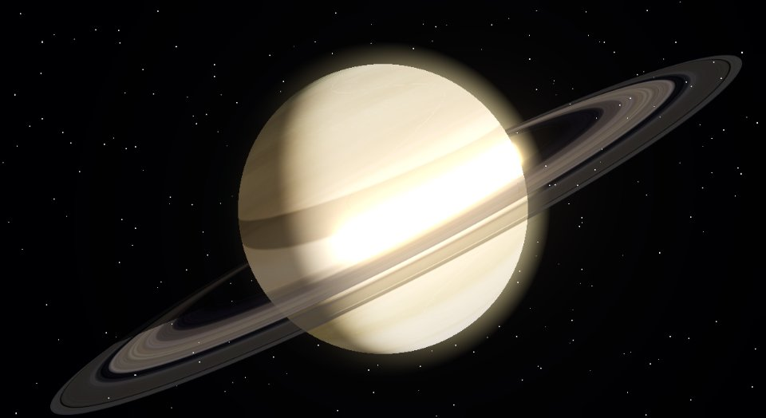
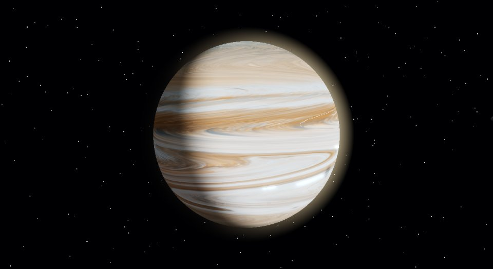
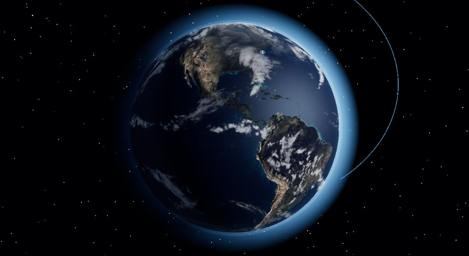
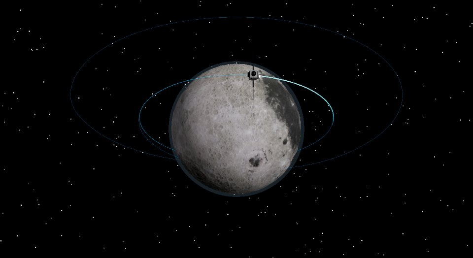
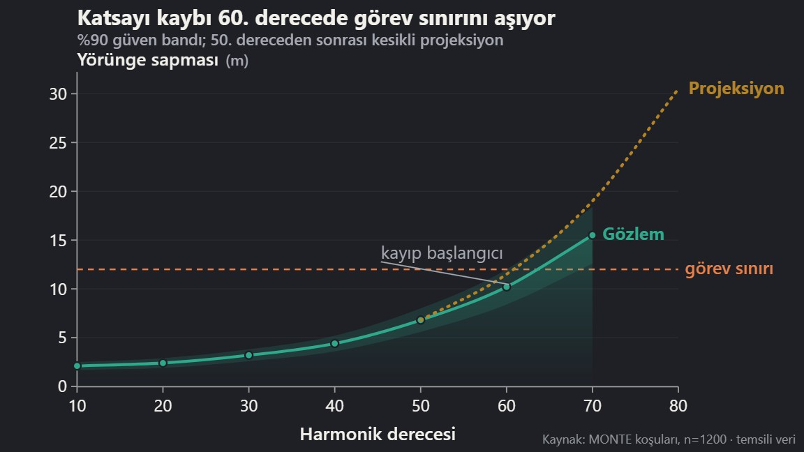
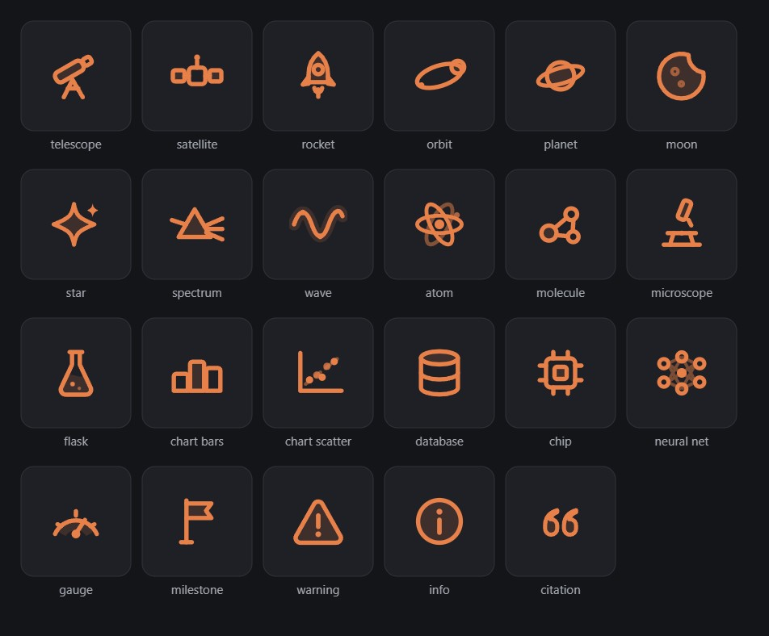

# Sunumatik

**Bilim sunumları için preset kütüphanesi** — gerçek fizikten türetilmiş WebGL gök cismi sahneleri, bildirimsel grafik motoru, hareket/geçiş presetleri, renk temaları ve bunları üreten 17 yapay zekâ becerisi. Tamamı bağımsız HTML/CSS/JS: derleme adımı yok, internet bağımlılığı yok, `file://` dışında her yerel sunucuda çalışır.

<p align="center">
  
</p>

| | | |
|:---:|:---:|:---:|
|  |  |  |
| **Satürn** — halka gölgeleriyle | **Jüpiter** — canlı kuşaklar, uydu geçişleri | **Terra** — şehir turlu Dünya |
|  |  |  |
| **Lunaris** — yörüngede uydu | **Chart** — spec ver, grafik al | **İkonlar** — 23 bilim ikonu |

## Hızlı başlangıç

```
demo\sunumu-baslat.cmd
```

Yerel sunucu açılır ve tüm preset'leri kullanan örnek deste yüklenir
(`http://localhost:8781/demo/index.html`). Tarayıcılar `file://` altında ES
modüllerini engellediği için yerel sunucu şarttır — herhangi bir statik
sunucu (`python -m http.server`) yeterlidir.

Bir sayfaya gömme (çalışan şablon: [`demo/sol-tek-basina.html`](demo/sol-tek-basina.html)):

```html
<script type="importmap">{ "imports": { "three": "presets/moon_advanced/vendor/three.module.min.js" } }</script>
<link rel="stylesheet" href="presets/moon_react_source/components/moon_react_source.css">
<script type="module">
  import { mountSol } from './presets/sun_advanced/sol-sun.mjs';
  const sol = await mountSol(document.querySelector('#host'));
  // sol.triggerFlare() · sol.advance(sn) · 2B tuvale gömmek için: sol-decor.mjs
</script>
```

## Ne var?

### WebGL sahneleri — `presets/`

Hepsi gerçek fizikten türetilmiş, "efekt yığını değil" ilkesiyle: her görsel
öğe adlandırılmış bir fenomene karşılık gelir ve altyazı gerçek/temsilî
ayrımını açık tutar.

| Klasör | İçerik |
|---|---|
| [`sun_advanced/`](presets/sun_advanced) | Prosedürel aktif Güneş: diferansiyel dönme, Joy yasalı benek çiftleri, patlama kurdeleleri, kademeli manyetik ilmek takımı, 240k parçacıklı akışkan püskürmeler, tutulma-anatomili korona. `sol-decor.mjs` ile herhangi bir 2B tuvale "uzak Güneş" olarak kompozitlenir. |
| [`moon_advanced/`](presets/moon_advanced) | Gerçek dokulu Ay + yörünge uçuşu. `vendor/` klasörü three.js'i barındırır — diğer sahneler buradan import eder, **kardeş klasör yapısını bozmayın**. |
| [`earth_advanced/`](presets/earth_advanced) | Dünya: gece ışıkları (terminatör maskeli), fresnel atmosfer, 8 gerçek şehirlik rehberli tur. |
| [`planets_advanced/`](presets/planets_advanced) | Merkür→Neptün: gaz devlerinde canlı atmosferler (zıt kuşak rüzgârları, Büyük Kırmızı Leke, Satürn altıgeni + halka gölgeleri), Galile uyduları ve geçiş gölgeleri, NASA veri paneli. |
| [`moon_react_source/`](presets/moon_react_source) | Lunaris'in React/Next.js orijinali + doku ve yörünge verileri + ortak CSS. |
| [`lunar_orbit/`](presets/lunar_orbit) | Hafif analitik iki-cisim Ay yörünge modeli. |
| [`cosmos_advanced/`](presets/cosmos_advanced) | Derin uzay fonu: tohumlu yıldız alanı (gerçekçi kadir dağılımı, kara-cisim renkleri, sintilasyon), **gerçek ESO GigaGalaxy Samanyolu panoraması** (prosedürel yedekli), opsiyonel bulutsu, deterministik meteorlar; dikdörtgen dekor modülüyle gömülür. |
| [`jwst_explorer/`](presets/jwst_explorer) | 10 resmi James Webb / Hubble görüntüsü üstünde etkileşimli keşif: yaylı pan/zoom, yayın metinlerinden ilgi noktaları, Webb↔Hubble / NIRCam↔MIRI tek-kameralı karşılaştırma perdesi. Krediler gömülü. |

### Bileşenler ve hareket

| Klasör | İçerik |
|---|---|
| [`charts_icons/chart-preset/`](presets/charts_icons/chart-preset) | **Bildirimsel grafik motoru**: spec ver → animasyonlu SVG al. Çizgi/sütun/saçılım, belirsizlik bantları, etiketli eşikler, epistemik çizgi stilleri (gözlem düz; fit/projeksiyon kesikli — saçılımda bile), görünüme girince çizilme. |
| [`motion_core/`](presets/motion_core) | Açılma/reveal, hover etkileşimleri, FLIP morph, premium slayt geçişleri (işaret bırakan zoom dahil), tablo hareketi (satır kaskadı, satır flaşı, sütun vurgusu), **primitives mikro-hareket seti** (ışıltı süpürmesi, kademeli fade-in-blur metin, telemetri çözülmesi, başlık morfu, yaylı sayaç + odometre, spot/eğim/mıknatıs, kenar kuyruğu, parıltı, sonsuz şerit). |
| [`color_themes/`](presets/color_themes) | **17 palet** (CSS token'ları; her biri renk-teorisi harmonisini bildirir, genişletilmişlerde 6 veri rengi + sıralı/ıraksak rampalar + renk körlüğü notları), kart preset'leri (stat/tanım/ikon, aksan çubuğu sistemi, giriş kaskadı), tablo preset'leri, 10 uzay motifi SVG kiti. |
| [`figure_callouts/`](presets/figure_callouts) | Figür üzerinde adım adım anlatım: kutu/daire/ok işaretleri, spot ışığı, büyüteç merceği, iddia satırları. |
| [`equation_steps/`](presets/equation_steps) · [`equation_pen/`](presets/equation_pen) · [`equation_theme/`](presets/equation_theme) | Denklemi terim terim anlatan adımlayıcı · kalemle yazma efekti · dizgi teması. |
| [`timeline_tree/`](presets/timeline_tree) · [`neural_network/`](presets/neural_network) | Kronoloji ağacı · sinir ağı ileri-geçiş animasyonu. |
| [`charts_icons/icons/`](presets/charts_icons/icons) | 23 duotone bilim ikonu (SVG sprite, kahraman katman). |
| [`charts_icons/icon-library/`](presets/charts_icons/icon-library) | 168 ikonluk yardımcı kütüphane (Lucide/Tabler/Phosphor): TR+EN aranabilir manifest, sprite, canlı filtreli önizleme, lisans metinleri. |
| [`charts_icons/domain-icons/`](presets/charts_icons/domain-icons) | **172 ikonluk alan seti** (duotone, bilim setiyle aynı el): matematik 28 · sinyal & kontrol 30 · fizik 24 · astrodinamik 30 · roket & uydu 30 · ML 18 · gökcisimleri 12. Bilimsel iddia taşır — odakta birincil cisim, kapanmayan hiperbol, gerçek nav-ball prograde/retrograde işaretçileri. Aile çipli önizleme + `STYLE-CARD.md` (seti genişletmek için çizim sözleşmesi). |
| [`deck_starter/`](presets/deck_starter) | Yeni desteler için minimum iskelet (sabit sahne + klavye + export kancaları). |

### `skills/` — üretim talimatları

Bu kütüphaneyi üreten ve kullanan 17 yapay zekâ becerisi (SKILL.md +
references + scripts). Bir yapay zekâ ajanına (ör. Claude Code)
`.agents/skills/` altına kopyalanarak verilir; ajan deste kurarken bu
kuralları uygular. Öne çıkanlar:

- **Metin hattı** — dört katman: öz seçimi → *iddia zanaatı*
  (`write-assertive-slide-copy`: her görünür satır bir şey söyler; duvar
  metin, kelime konfetisi ve ok-zinciri yasak) → TR/EN dil yüzeyi →
  yoğunluk/punto tabanları. Türkçe-farkında doğrulayıcılarla.
- **Tasarım yasaları** — WebGL sahne sözleşmesi (süreklilik anayasası,
  GLSL güvenliği, ışık disiplini, prosedürel dağılımlar), hizalama/grid
  disiplini, nötr renk disiplini, dekor katmanlama.
- **Uçtan uca akış** — orkestratör + anlatı + kanıt doğrulama + tema +
  denklem + görselleştirme + kurulum + denetim/export becerileri.

Beceri dokümanlarındaki `/presets/...` yolları bu deponun köküne göredir.

## demo/

[`demo/index.html`](demo/index.html) — tüm preset'leri bir arada kullanan
15 slaytlık örnek deste. [`demo/sol-tek-basina.html`](demo/sol-tek-basina.html)
— tek sahneyi gömmenin asgari şablonu.

## Teknik notlar

- **Bağımlılık yok:** three.js `presets/moon_advanced/vendor/` altında
  gömülüdür; hiçbir CDN/font/ağ isteği yoktur, çevrimdışı çalışır.
- **Erişilebilirlik ve export:** tüm hareketli preset'ler
  `prefers-reduced-motion` altında son kareyi gösterir;
  `html[data-export="true"]` deterministik export karesi üretir; klavye
  gezinimi (`data-owns-arrows`/`data-owns-keys`) deste çalıştırıcılarıyla
  uyumludur. Her hareketli preset bir `motion-manifest.json` taşır
  (model, sınırlar, reduced-motion ve export durumu).
- **Determinizm:** sahneler tohumludur ve `advance(saniye)` API'siyle
  kare kare sürülebilir (test ve export için).

## Lisans ve atıf

- Kod ve tasarım: © Ayberk — tüm hakları saklıdır (izin için iletişime geçin).
- `presets/moon_advanced/vendor/` — [three.js](https://threejs.org) (MIT).
- `presets/planets_advanced/textures/` — [Solar System Scope](https://www.solarsystemscope.com/textures/) (CC BY 4.0; kullanımda atıf zorunludur, ayrıntı `asset-provenance.json` içinde).
- Dünya/Ay dokuları — NASA görüntüleri (three.js örnek deposu üzerinden).
- `presets/jwst_explorer/images/` — resmi James Webb / Hubble yayın görüntüleri, [esawebb.org](https://esawebb.org) ve [esahubble.org](https://esahubble.org) (CC BY 4.0; her görüntünün zorunlu kredi satırı `images/manifest.json` ve `images/LICENSE-NOTES.md` içinde — preset krediyi görüntü üstünde kalıcı gösterir, kaldırmayın).
- `presets/cosmos_advanced/textures/milkyway-eso0932a.jpg` — ESO GigaGalaxy Zoom 360° Samanyolu panoraması, **ESO/S. Brunier** (CC BY 4.0; fotoğrafik bandı kullanan her destede bu kredi görünür olmalıdır, ayrıntı `textures/CREDITS.md`).
- `presets/charts_icons/icon-library/` — [Lucide](https://lucide.dev) (ISC), [Tabler Icons](https://tabler.io/icons) (MIT), [Phosphor](https://phosphoricons.com) (MIT); lisans metinleri `icon-library/licenses/` altında.
- `presets/motion_core/primitives-motion.*` — [motion-primitives](https://github.com/ibelick/motion-primitives)'ten uyarlanmıştır (MIT, © ibelick).
